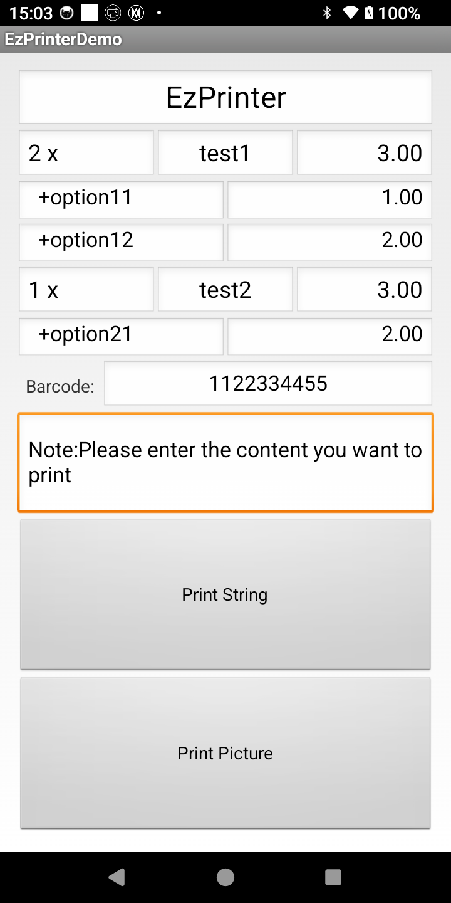
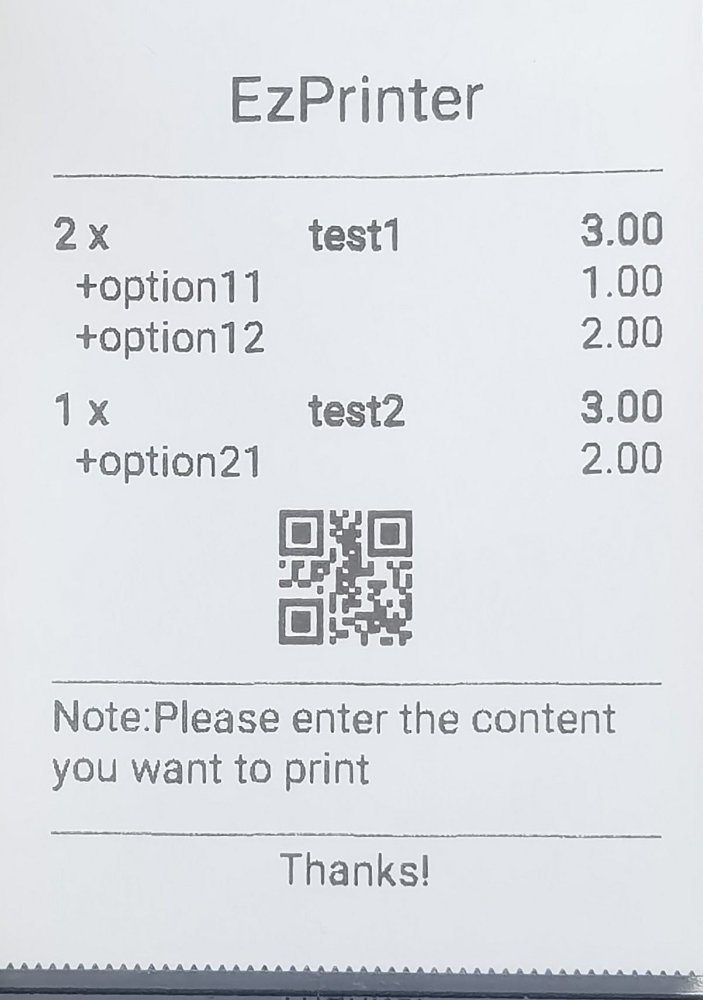

# Ezprinter Demo

This demo demonstrates how to easily print receipts on Goodcom devices using the EzPrinter SDK.
The EzPrinter SDK support all the goodcom android pos printer(Printing devices can be viewed [here](https://www.igoodcom.com/)).
<p float="left">
  
  
</p>

## Main Features

1.Print text (you can set font size and alignment)
2.Print image (you can set alignment)
3.Print barcode or qrcode (Set barcode through parameters)

## Getting Started

Add string to app’s build.gradle file:
```
dependencies{

implementation("cn.goodcom:ezprinter:2.+")
}
```

Then Import `com.goodcom.gcprinter.GcPrinterUtils` at the beginning of the java file:
```
import com.goodcom.gcprinter.GcPrinterUtils;
```

## Function list

```
  boolean isDeviceSupport ();
  void drawText(String strLeft, int fontLeft, String strMid, int fontMid, String strRight, int fontRight);
  void drawBarcode(String str,int align,int type, int height);
  void printText(Context context,boolean isAutoFeed);
  void printBitmap(Context context, Bitmap bitmap,int align,boolean isAutoFeed);
  void printImage(Uint8List img ,int align,bool isAutoFeed);
//Easy to use API
  void drawNewLine();
  void drawOneLine([int? fontSize]);
  void drawCustom(String str,int fontSize,int align);
  void drawLeftRight(String left,String right,int fontSize);
  void drawImage(String path);
  void drawQrCode(String str, int align, [int? height]);
  void openCashBox();
```

## Constants

Font size:
```
	public static final int fontDefault = 0;
	public static final int fontSmall = 1;
	public static final int fontMedium = 2;
	public static final int fontBig = 3;
	public static final int fontDoubleHeight = 4;
	public static final int fontDoubleWidth = 5;
	public static final int fontSmallBold = 6;
	public static final int fontMediumBold = 7;
	public static final int fontBigBold = 8;
	public static final int fontDoubleHeightBold = 9;
	public static final int fontDoubleWidthBold = 10;
```
Alignment
```
	public static final int alignLeft = 1;
	public static final int alignCenter = 2;
	public static final int alignRight = 3;
```
Barcode Type
```
	public static final int barcodeUpca = 0;
	public static final int barcodeUpce = 1;
	public static final int barcodeEan8 = 2;
	public static final int barcodeEan13 = 3;
	public static final int barcodeCode128 = 4;
	public static final int barcodeCode39 = 5;
	public static final int barcodeCodeBar = 6;
	public static final int barcodeItf = 7;
	public static final int barcodeCode93 = 8;
	public static final int barcodeQrCode = 0x80;
```

## Example

```
	GcPrinterHelper.getInstance().drawCustom(“EzPrinter”,GcPrinterHelper.fontBig,GcPrinterHelper.alignCenter);
	GcPrinterHelper.getInstance().drawOneLine();
	GcPrinterHelper.getInstance().drawNewLine();
	GcPrinterHelper.getInstance().drawText(“1 x ”,GcPrinterHelper.fontSmallBold,
						“tesst1”,GcPrinterHelper.fontSmallBold,
						“3.00”,GcPrinterHelper.fontSmallBold);
	GcPrinterHelper.getInstance().drawLeftRight(“+option1”,0,
							“1.00”,0);
	GcPrinterHelper.getInstance().drawNewLine();
	GcPrinterHelper.getInstance().drawText(“3 x ”,GcPrinterHelper.fontSmallBold,
						“test2”,GcPrinterHelper.fontSmallBold,
						“6.00”,GcPrinterHelper.fontSmallBold);
	GcPrinterHelper.getInstance().drawLeftRight(“+option2”,0,
							 “2.00”,0);
	GcPrinterHelper.getInstance().drawNewLine();
	GcPrinterHelper.getInstance().drawBarcode(“123”,GcPrinterHelper.alignCenter,GcPrinterHelper.barcodeQrCode);
	GcPrinterHelper.getInstance().drawOneLine();
	GcPrinterHelper.getInstance().drawCustom(“Tips: test”,0,0);
	GcPrinterHelper.getInstance().drawOneLine();
	GcPrinterHelper.getInstance().drawCustom("Thanks!",0,GcPrinterHelper.alignCenter);
	GcPrinterHelper.getInstance().printText( getApplicationContext(), true);

```

